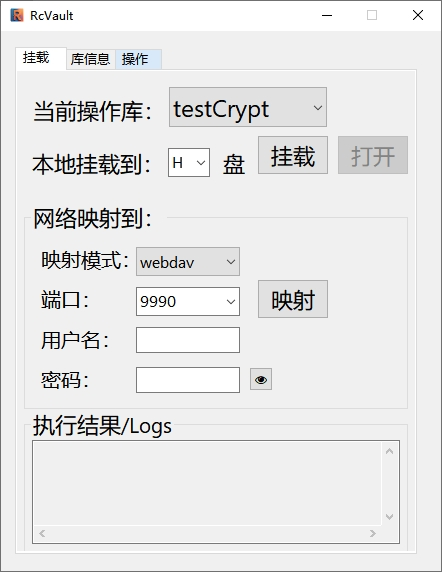
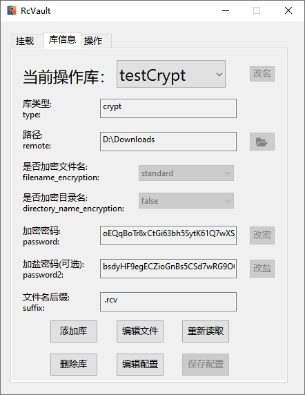

# RcVault

基于rclone的crypt存储进行文件加密的保险箱GUI，使用aardio写就，目前只支持Windows。

rclone 的 crypt 存储类型，可以作为用户透明加密文件的保险库，本GUI可以方便管理 rclone crypt 保险库。

# 介绍

## 原理

[rclone](https://rclone.org/) 是一个开源的存储管理工具，支持多种本地和云盘存储。

[rclone](https://rclone.org/) 支持一种 [crypt](https://rclone.org/crypt/) 格式的存储，其实就是在普通存储层上加了一层加密层。

通过这层加密层，写入到普通存储上的文件，就被 256 位密钥的 AES 算法加密了。只有通过这层加密层和正确的密码，才能读取到原始的文件，而在普通存储上读取到的就是乱码密文。

## 优点

* 这种加密层可以加到任何存储上，加密过程也是透明加密，而不是容器加密，你可以放心地将加密后的文件夹上传到网盘，而不用担心泄密。
* 支持多种挂载映射方式，挂载后在Windows上直接通过文件管理器操作文件，全过程透明无感。
* 可选是否加密文件名或目录名。
* rclone 是 go 语言写的开源软件，高效，跨平台，在各种系统上都能用，所以无需担心加密不安全，无需担心跨平台兼容问题。

## 缺陷

  * 所有保险库内的文件都是使用用户密码加密的，所以无法改密码。唯一改密码的方式就是先打开保险库，再将保险库的文件复制到另一个密码不同的保险库中，解密再加密。

  * 你在使用一个密码打开一个文件夹时，**不会有错误提示**。rclone 只负责用该密码在指定文件夹上打开一个加密层。只有当输入的密码和之前的密码相同时，才能正确读取到之前写入的文件。

所以，在使用保险库时，一定要记好你的密码，一旦忘记了，数据是找不回来的！建议使用 keepass 之类的密码管理器保管密码。

# 使用

rclone 管理保险库有多种方式，本GUI仅使用它的 crypt存储格式，用server 和 mount 功能进行挂载和映射，通过GUI操作管理rclone的配置文件。

挂载(mount)到指定盘符或指定目录，映射(serve)到 webdav、ftp、sftp、http 服务上，供用户访问。

当映射到 webdav 等网络协议时，就可以方便同一局域网的设备访问，同时，还可以设置访问密码。

# 依赖

  * 加密依赖于 rclone，所以请先确保 rclone 核心文件的存在。

    * 随发布的主程序res目录下附带rclone.exe ， 或者手动下载后存放到主程序文件的res目录下，并确保文件名为`rclone.exe` 。
    * 配置文件会自动创建，或手动编辑后确保配置文件名为`rclone.conf` ，存放在res目录下。
  * 需要注意的是，rclone 的挂载功能依赖于 FUSE，所以在 Windwos 上挂载需要先安装 [winfsp](https://github.com/billziss-gh/winfsp/releases) 。

# 运行图

 
     
     

# 致谢

项目启发自 [RcloneVault](https://github.com/HaujetZhao/RcloneVault)

